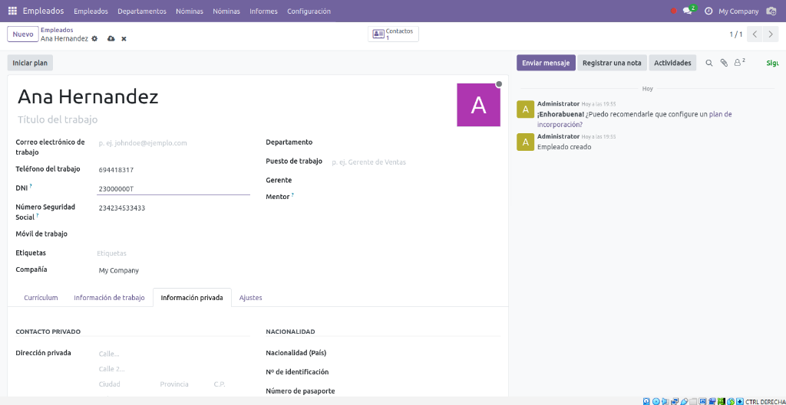

# TAREA 13 – EXTENSIÓN DE MÓDULOS
**Alumno:** [Tu Nombre]

Este repositorio contiene la extensión del módulo de empleados (`hr.employee`) solicitada en la Tarea 13. El módulo se llama `hr_employee_extended`.

## Descripción del Desarrollo

Para realizar esta tarea, he creado un nuevo módulo que hereda de la funcionalidad base de Odoo. A continuación explico los pasos técnicos seguidos a nivel de código:

### 1. Modelo de Datos (`models.py`)
He extendido el modelo `hr.employee` utilizando la herencia de clase (`_inherit = 'hr.employee'`).

*   **Nuevos Campos**: He definido dos campos de tipo `Char`: `nss` (Número de Seguridad Social) y `dni` (Documento Nacional de Identidad).
*   **Validaciones**: He utilizado el decorador `@api.constrains` para crear una función de validación personalizada `_check_nss_dni`.
    *   Esta función comprueba primero que los campos **no estén vacíos** (son obligatorios).
    *   Verifica la longitud exacta (12 para NSS, 9 para DNI).
    *   Implementa los algoritmos matemáticos correspondientes (Módulo 97 para NSS y Módulo 23 para la letra del DNI) para asegurar que los números sean reales.

### 2. Vista (`views.xml`)
He extendido la vista formulario original de empleados (`hr.view_employee_form`) usando un registro `ir.ui.view` con herencia.

*   **Ubicación de Campos**: Para mejorar la experiencia de usuario, he decidido colocar los campos en la cabecera de **Información General** (la parte superior de la ficha), en lugar de esconderlos en pestañas inferiores.
*   **XPath**: He utilizado expresiones XPath para localizar el campo `mobile_phone` e inyectar mis nuevos campos justo antes.
*   **Limpieza**: Como Odoo a veces trae un campo `ssnid` por defecto, he añadido una instrucción para ocultarlo (`invisible="1"`) y evitar duplicidades y confusión.

## Instalación y Pruebas

1.  Actualizar la lista de aplicaciones en Odoo.
2.  Instalar o actualizar el módulo **HR Employee Extension**.
3.  Ir a la ficha de un empleado y verificar que aparecen los campos DNI y NSS.
4.  Intentar guardar sin rellenarlos para comprobar que la validación de obligatoriedad funciona.
